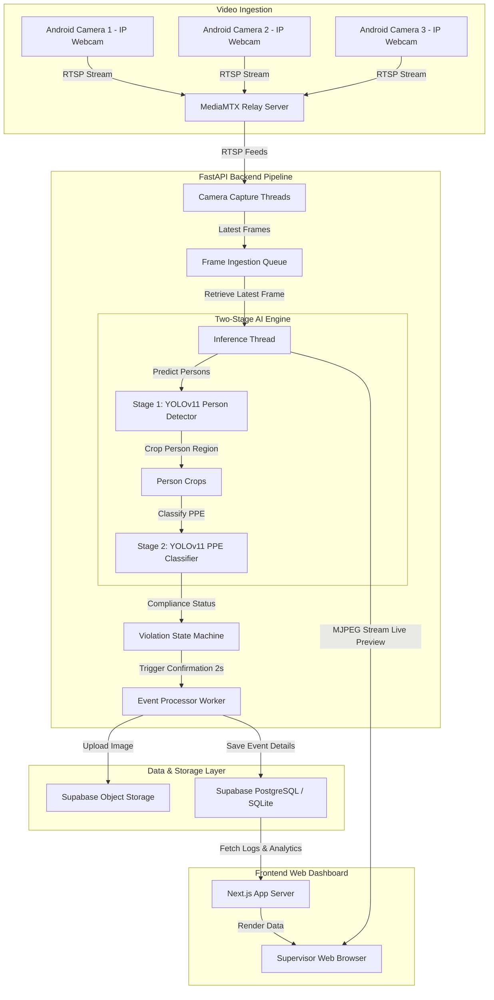

# Technical Architecture: NTPC PPE Detection PoC

This document provides a detailed technical overview of the AI-based multi-camera safety compliance and violation tracking system developed for NTPC.

---

## 1. System Overview

The system consists of a video ingestion pipeline, an AI detection engine, a time-based violation rules engine, metadata and object storage, and a web dashboard. 

The architecture is designed to run locally on an edge computer (RTX 4070 Laptop) while leveraging Supabase (free tier) for persistent metadata storage and screenshot storage.

---

## 2. Multi-Camera Threading Model

To handle multiple live RTSP feeds at $\ge 10$ FPS without UI lag or frame dropping, the backend implements a multi-threaded processing model:

1. **Camera Capture Threads (`CameraCapture`)**:
   - Every configured camera runs in a dedicated background thread.
   - It connects to the RTSP feed via OpenCV (`cv2.VideoCapture`).
   - If the camera goes offline, it retries connecting.
   - It reads frames continuously, keeping only the *latest frame* to prevent buffer buildup.
   - When a video file is used instead of RTSP, it paces reads to native FPS and loops the file when it reaches the end.

2. **Inference Loop Thread (`InferenceLoop`)**:
   - A single, dedicated thread runs the AI prediction pipeline.
   - It iterates through all active, online camera configurations.
   - It fetches the latest frame from the capture thread.
   - It processes the frame using the **Two-Stage AI Engine**.
   - It updates the latest annotated frame in memory for MJPEG streaming.

3. **Event Processor Worker (`EventProcessorWorker`)**:
   - Runs in a background worker thread.
   - It consumes confirmed violation events from a thread-safe FIFO Queue (`queue.Queue()`).
   - It saves the raw annotated frame to disk (local fallback) or uploads it to Supabase Storage.
   - It records the violation metadata (timestamp, camera ID, zone, type, confidence, shift, screenshot URL) to the database.

4. **FastAPI Web Server**:
   - Handles HTTP API endpoints (fetching logs, analytics summaries, camera CRUD).
   - Serves the live camera feeds via **MJPEG multipart streaming** by capturing the latest annotated frame in memory from the inference pipeline.

---

## 3. Two-Stage AI Pipeline

Inference is divided into two sequential stages to optimize performance and reduce background false positives:

1. **Stage 1 (Person Detection)**:
   - Uses a COCO-pretrained `yolov11n.pt` model.
   - Filters classes to class `0` (`person`) only.
   - Runs on the full input frame.
   - Employs Ultralytics' built-in tracking (`model.track(persist=True)`) to maintain unique worker tracking IDs.

2. **Stage 2 (PPE Crop Classification)**:
   - The region of interest (ROI) for each detected person is cropped.
   - The cropped person image is passed to a custom-trained YOLOv11 model (`models/ppe_crop_detector.pt`).
   - The model classifies the crop into:
     - `helmet` (Class 0)
     - `head` (unprotected head, Class 1)
     - `vest` (Class 2)
   - If `models/ppe_crop_detector.pt` is not found, the system falls back to a pipeline mock logic for structural validation.

---

## 4. Violation Rules State Machine

To prevent false alarms caused by brief occlusions or frame noise, a time-based validation state machine tracks workers:

- **State Check**: Every tracked person (by track ID) is evaluated on each frame.
- **Violation Confirmation**: A violation is only confirmed if a worker remains in a non-compliant state (missing helmet, missing vest, or both) continuously for $\ge 2.0$ seconds.
- **Track-Loss Reset**: If tracking is lost for $> 1.0$ second, the violation timer is reset.
- **One Alert Per Entry**: Once a violation is confirmed, an alert is triggered. The tracking ID is put on a **30-second cooldown** to suppress duplicate alerts for the same worker.

---

## 5. Database Schema

The system supports SQLite (local testing) and PostgreSQL (Supabase cloud).

### 5.1. Cameras Table (`cameras`)
Stores metadata about the active video ingest channels.

| Column | Type | Description |
|--------|------|-------------|
| `id` | TEXT (PK) | Unique camera identifier (e.g. `cam_1`) |
| `rtsp_url` | TEXT | Source stream RTSP connection string or file path |
| `zone_name` | TEXT | Physical monitoring location (e.g. `Main Entrance`) |
| `is_online` | BOOLEAN | Operational status determined by capture loop |
| `last_seen` | TIMESTAMP | Last time the camera was active |

### 5.2. Violations Table (`violations`)
Stores individual confirmed safety infractions.

| Column | Type | Description |
|--------|------|-------------|
| `id` | INTEGER (PK) | Auto-incrementing identifier |
| `camera_id` | TEXT (FK) | Reference to `cameras.id` |
| `zone` | TEXT | Zone name snapshot where infraction occurred |
| `timestamp` | TIMESTAMP | Time infraction was confirmed |
| `violation_type`| TEXT | Violation class (`helmet_missing`, `vest_missing`, `both_missing`) |
| `confidence` | FLOAT | Detection confidence score (0.0 - 1.0) |
| `screenshot_url`| TEXT | URL pointing to stored screenshot in Supabase |
| `shift` | TEXT | Configured operational shift snapshot (e.g. `morning`) |
