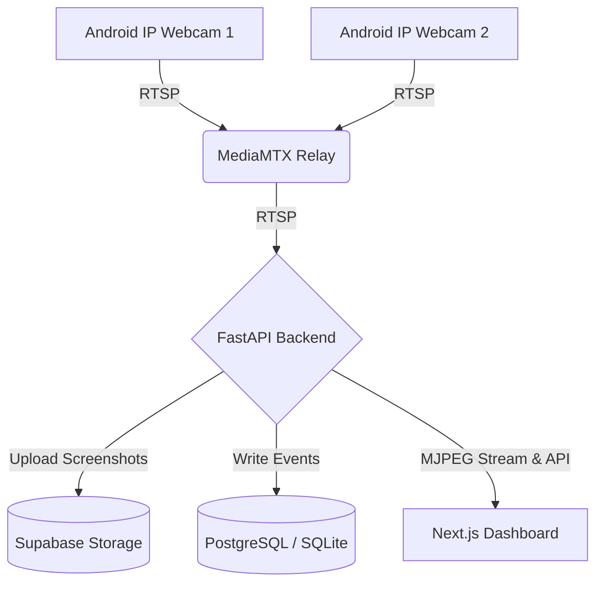
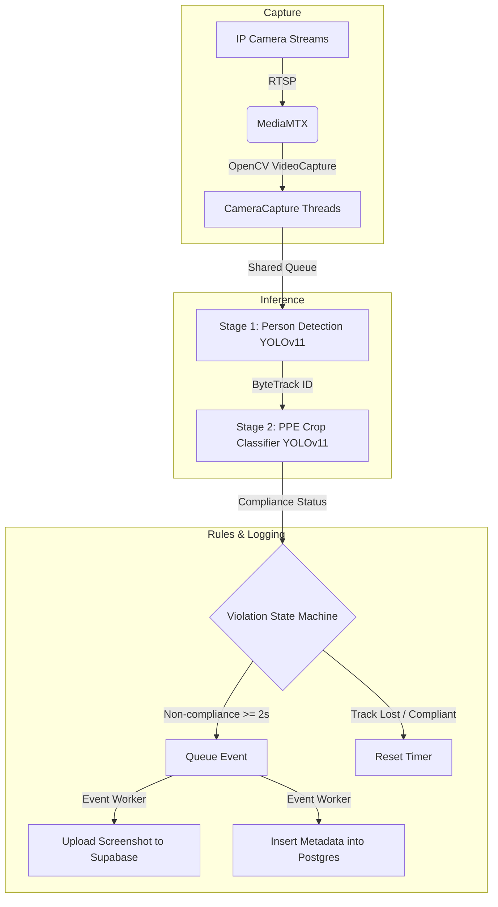
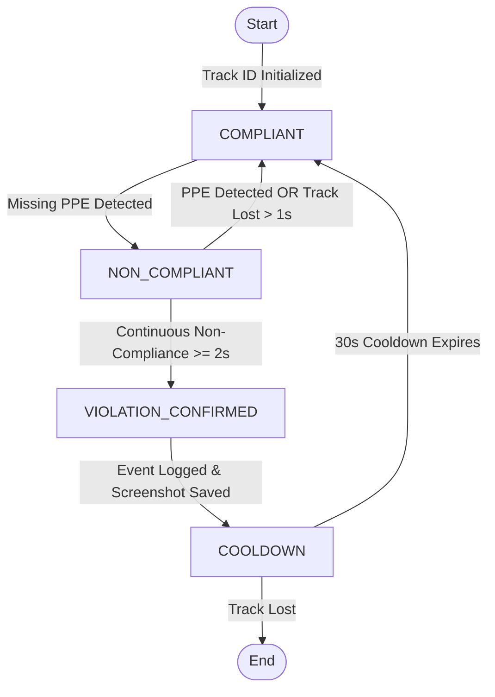
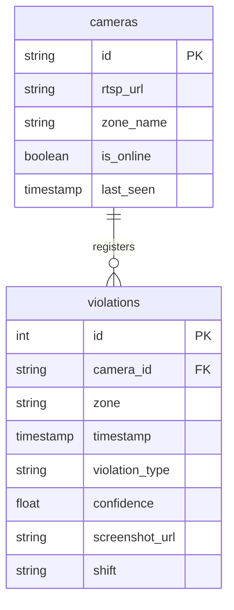

# Software Requirements Specification (SRS)
## NTPC Safety Monitor (PPE Detection PoC)

## Document Information

| Field | Value |
|-------|-------|
| Project Name | NTPC Safety Monitor (PPE Detection PoC) |
| Document Version | 1.0 |
| Date | 2026-06-15 |
| Author | Vocational Trainees (IT) |
| Status | Finalized |

## Revision History

| Version | Date | Author | Description |
|---------|------|--------|-------------|
| 1.0 | 2026-06-15 | Vocational Trainees (IT) | Initial version compiling specifications and requirements |

---

# 1. Introduction

## 1.1 Purpose
This Software Requirements Specification (SRS) document details the functional and non-functional requirements of the NTPC Safety Monitor (PPE Detection PoC). The system is designed to automate safety compliance monitoring by detecting whether workers wear mandatory safety gear (hard hats and reflective vests) upon entering plant premises.

The primary audience for this document includes:
- NTPC Internship Evaluation Committee (presentation/demo review)
- System architects and developers
- Plant safety supervisors and operators

## 1.2 Scope
### 1.2.1 Product Name
NTPC Safety Monitor (PPE Detection PoC)

### 1.2.2 Product Description
The NTPC Safety Monitor is an AI-powered safety monitoring application. It ingests video feeds from multiple Android-based cameras located at plant entrances, performs real-time object detection and tracking, identifies PPE violations (missing helmets or vests), and publishes real-time logs, analytics, and screenshots to a web dashboard for supervisor inspection.

### 1.2.3 Objectives
- Automate gate compliance checks to reduce human monitoring oversight.
- Provide high-throughput local AI processing on the RTX 4070 platform (≥ 10 FPS per stream).
- Capture and persist high-quality image evidence for all confirmed violations.
- Provide a Next.js-based web interface to track active cameras, violation logs, and historical trends.

### 1.2.4 Benefits
- Implements proactive safety culture enforcement with minimal manual inspection costs.
- Generates reliable, queryable violation logs with photographic proof (screenshots).
- Provides shift-based analytics to identify high-risk periods or gates.

## 1.3 Definitions, Acronyms, and Abbreviations

| Term | Definition |
|------|------------|
| SRS | Software Requirements Specification |
| FR | Functional Requirement |
| NFR | Non-Functional Requirement |
| PPE | Personal Protective Equipment (Helmet and Safety Vest) |
| RTSP | Real-Time Streaming Protocol |
| MJPEG | Motion JPEG (Video streaming protocol over HTTP) |
| YOLO | You Only Look Once (Real-time object detection model family) |
| PoC | Proof of Concept |
| COCO | Common Objects in Context (Dataset for pretraining person detection) |
| DFD | Data Flow Diagram |
| ERD | Entity-Relationship Diagram |

## 1.4 References

| Reference | Title | Version | Date | Source |
|-----------|-------|---------|------|--------|
| REF-001 | [SPEC.md](file:///c:/Users/ashmi/OneDrive/Documents/ntpc_vocational/.gsd/SPEC.md) | 1.0 | 2026-06-13 | Local Project Memory |
| REF-002 | [ARCHITECTURE.md](file:///c:/Users/ashmi/OneDrive/Documents/ntpc_vocational/.gsd/ARCHITECTURE.md) | 1.0 | 2026-06-13 | Local Project Memory |
| REF-003 | [STACK.md](file:///c:/Users/ashmi/OneDrive/Documents/ntpc_vocational/.gsd/STACK.md) | 1.0 | 2026-06-13 | Local Project Memory |
| REF-004 | [ntpc_ppe_detection_poc_plan_v3.md](file:///c:/Users/ashmi/OneDrive/Documents/ntpc_vocational/ntpc_ppe_detection_poc_plan_v3.md) | 3.0 | 2026-06-13 | Original Project Plan |

## 1.5 Overview
This document is structured as follows:
- **Section 1 (Introduction)**: Defines the purpose, scope, and terminology of the system.
- **Section 2 (Overall Description)**: Focuses on the product perspective, system interfaces, constraints, assumptions, and dependencies.
- **Section 3 (Specific Requirements)**: Specifies the functional and non-functional requirements with precise IDs, inputs, processing logic, and outputs.
- **Appendices**: Contains the glossary, analysis models (Mermaid diagrams), and the Requirements Traceability Matrix.

---

# 2. Overall Description

## 2.1 Product Perspective

### 2.1.1 System Context
The NTPC Safety Monitor operates on a local network. Cameras ingest video frames from entry gates, which are aggregated and routed through MediaMTX. The FastAPI backend executes two-stage YOLOv11 inference on a local GPU, evaluates compliance state machines, updates databases, and streams live annotated feeds to the Next.js supervisor dashboard.

### 2.1.2 System Interfaces

| Interface | System | Description | Protocol |
|-----------|--------|-------------|----------|
| INT-001 | MediaMTX | Ingests live streams from Android IP Webcam endpoints. | RTSP |
| INT-002 | Supabase DB | Cloud-hosted remote PostgreSQL database for storing metadata. | TCP/IP (PostgreSQL) |
| INT-003 | Supabase Storage | Cloud-hosted object bucket for storing violation screenshots. | HTTPS REST API |
| INT-004 | Local DB | Failover SQLite database (`violations.db`) for offline development. | Local filesystem |
| INT-005 | Next.js Frontend | Frontend dashboard communication with backend service. | HTTP/REST & MJPEG |

### 2.1.3 User Interfaces
The supervisor dashboard supports the following screens:
1. **Dashboard Overview**: Displays summary cards (active cameras, total violations, top violation zones) and shift metrics.
2. **Live View**: Displays live grid feeds via HTTP multipart MJPEG streaming. Shows status indicators (online/offline).
3. **Violation Logs**: Displays a paginated table of historical violations containing timestamp, camera, zone, type, confidence, and preview thumbnails linking to the full screenshot.
4. **Analytics**: Renders graphs showing violations over time, by camera, zone, and shift.

### 2.1.4 Hardware Interfaces
- **Inference Server**: Local machine with GPU capability (recommended RTX 4070 with ≥ 8 GB VRAM).
- **Cameras**: 2–3 Android mobile phones running Pavel Khlebovich's "IP Webcam" app.

### 2.1.5 Software Interfaces
- **Operating System**: Windows (tested with PowerShell/CMD)
- **Deep Learning Framework**: Ultralytics YOLOv11 running on PyTorch CUDA (`cu124`).
- **Web App Stack**: Next.js 16+ on Node.js 20+, TailwindCSS 4, Recharts, and FastAPI.

### 2.1.6 Communications Interfaces
- All RTSP streams are transported over local TCP/UDP networks via port 8554.
- Next.js dashboard requests APIs from FastAPI on port 8000.
- Screenshot uploads to Supabase are encrypted using HTTPS.

## 2.2 Product Functions

| Feature ID | Feature Name | Description |
|------------|--------------|-------------|
| F-001 | Multi-Stream Ingestion | Captures RTSP feeds from multiple camera feeds concurrently. |
| F-002 | Double-Stage PPE Detection | Detects workers and classifies helmet/vest compliance status. |
| F-003 | Time-based Confirmation | Uses tracking IDs to verify violations sustained for ≥ 2 seconds. |
| F-004 | Screenshot Evidence Upload | Capture annotated frames and uploads them to Supabase Storage. |
| F-005 | Supervisor Portal | Live streams, event logging, shift-based analytics, and CSV exports. |

## 2.3 User Characteristics

### 2.3.1 User Classes

| User Class | Description | Technical Level | Frequency of Use |
|------------|-------------|-----------------|------------------|
| Shift Supervisor | Plant safety managers monitoring gates during shifts. | Basic computer skills (uses web browsers). | Continuous throughout shift. |
| System Administrator | Sets up cameras, defines shifts, and configures confidence thresholds. | High (familiar with CLI, networks, JSON files). | Occasional (during setup/updates). |

## 2.4 Constraints
- **Hardware Limitation**: All AI inference runs locally on the supervisor's workstation. Performance degrades if GPU is occupied or VRAM is insufficient.
- **Network Dependency**: Live snapshot streams and APIs depend on local Wi-Fi stability between phone cameras and the workstation.
- **Supabase Quotas**: Storage and PostgreSQL hosting are bound by Supabase free tier rate limits and size limits.

## 2.5 Assumptions and Dependencies
### Assumptions
- **Continuous Power & Wi-Fi**: Gates have stable Wi-Fi coverage for the IP Webcam streams.
- **Pre-trained Models**: Custom-trained crop-detector weights (`models/ppe_crop_detector.pt`) are pre-trained and available locally.

### Dependencies
- **Android IP Webcam**: Dependent on the app running on all target phones with port 8080 exposed.
- **MediaMTX Relay**: MediaMTX binary must be active to relay IP Webcam HTTP streams to RTSP streams.

---

# 3. Specific Requirements

## 3.1 External Interface Requirements

### 3.1.1 User Interfaces
- **UI-001 (Main Dashboard)**: Displays summary cards and key metric totals.
- **UI-002 (Live View Grid)**: Renders 2–3 video tiles simultaneously at ≥ 10 FPS.
- **UI-003 (Log View Table)**: Supports column-based sorting and filters for camera, zone, type, and dates.
- **UI-004 (Analytics Page)**: Includes interactive bar/line graphs showing hourly and shift-level aggregates.

### 3.1.2 Hardware Interfaces
- **HW-001 (GPU Cuda Driver)**: PyTorch must access Cuda 12.4 compatible driver on the RTX 4070 laptop.
- **HW-002 (Camera Mounts)**: Workstations must connect to cameras streaming at a minimum of 640 × 480 resolution at 15 FPS.

### 3.1.3 Software Interfaces
- **SW-001 (FastAPI Web Server)**: Runs on port 8000, serving CORS-compliant endpoints.
- **SW-002 (Supabase Client SDK)**: Communicates with Supabase API gateway via URL and anon API key configuration.

### 3.1.4 Communications Interfaces
- **COM-001 (RTSP protocol)**: Transmitted over default port 8554.
- **COM-002 (HTTP MJPEG Streaming)**: Transmitted using HTTP Multipart `multipart/x-mixed-replace`.

## 3.2 Functional Requirements

### 3.2.1 Video Ingestion & Processing

#### FR-001: Multi-Camera RTSP Stream Ingestion
| Attribute | Value |
|-----------|-------|
| **ID** | FR-001 |
| **Description** | The system shall ingest RTSP streams from 2–3 Android phones via MediaMTX relay concurrently using threaded frame readers. |
| **Priority** | Must |
| **Source** | SPEC Goal 1 |
| **Status** | Verified |

- **Inputs**: RTSP URLs (e.g. `rtsp://localhost:8554/cam_1`).
- **Processing**: Camera reader threads retrieve frames via OpenCV `VideoCapture`, keeping only the latest frame to prevent queue lag.
- **Outputs**: Frame queue access for the main inference loop.

#### FR-002: Camera Offline Status Indicator
| Attribute | Value |
|-----------|-------|
| **ID** | FR-002 |
| **Description** | The system shall detect camera offline status when video frame acquisition fails and expose the status to the dashboard APIs. |
| **Priority** | Must |
| **Source** | SPEC Goal 1 |
| **Status** | Verified |

- **Inputs**: OpenCV connection failures.
- **Processing**: Mark the specific camera metadata status flag as `offline`.
- **Outputs**: Dashboard status indicator turns red.

---

### 3.2.2 AI Object Detection & State Machine

#### FR-003: First-Stage Person Detection
| Attribute | Value |
|-----------|-------|
| **ID** | FR-003 |
| **Description** | The system shall detect human shapes in each camera stream using a COCO-pretrained YOLOv11 model. |
| **Priority** | Must |
| **Source** | SPEC Goal 2 |
| **Status** | Verified |

- **Inputs**: Video frame image.
- **Processing**: Run YOLOv11 person detector model. Filter output objects by class `person`.
- **Outputs**: Bounding box coordinates for detected persons.

#### FR-004: Second-Stage PPE Crop Detection
| Attribute | Value |
|-----------|-------|
| **ID** | FR-004 |
| **Description** | For each detected person bounding box, the system shall crop the image and run the fine-tuned YOLOv11 classifier. |
| **Priority** | Must |
| **Source** | SPEC Goal 2 |
| **Status** | Verified |

- **Inputs**: Cropped person image crop.
- **Processing**: Run classification via custom model (`models/ppe_crop_detector.pt`) to detect `helmet`, `head`, `vest`.
- **Outputs**: Predicted classes for helmet/head/vest with confidence scores.

#### FR-005: Compliance Classification Rules
| Attribute | Value |
|-----------|-------|
| **ID** | FR-005 |
| **Description** | The system shall classify a person into one of four states: Compliant, Helmet Missing, Vest Missing, or Both Missing. |
| **Priority** | Must |
| **Source** | SPEC Goal 2 |
| **Status** | Verified |

- **Inputs**: PPE detections.
- **Processing**:
  - If `head` is detected without `helmet` -> Helmet Missing.
  - If `vest` is missing -> Vest Missing.
  - Otherwise -> Compliant.
- **Outputs**: Compliance status code.

#### FR-006: Time-based Violation Confirmation
| Attribute | Value |
|-----------|-------|
| **ID** | FR-006 |
| **Description** | The system shall confirm a violation event only if a tracked person is continuously non-compliant for ≥ 2.0 seconds. |
| **Priority** | Must |
| **Source** | SPEC Goal 2 |
| **Status** | Verified |

- **Inputs**: Person Tracking ID and compliance status per frame.
- **Processing**: Track duration of continuous non-compliance per track ID.
- **Outputs**: Confirmed violation state when threshold is reached.

#### FR-007: Track Reset Logic
| Attribute | Value |
|-----------|-------|
| **ID** | FR-007 |
| **Description** | The system shall reset the violation timer if a tracked person becomes compliant or tracking is lost for > 1.0 second. |
| **Priority** | Must |
| **Source** | SPEC Goal 2 |
| **Status** | Verified |

- **Inputs**: Track ID updates.
- **Processing**: Check gap time in tracking updates; reset timers if criteria are met.
- **Outputs**: Reset compliance timer.

#### FR-010: One Alert Per Entry Cooldown
| Attribute | Value |
|-----------|-------|
| **ID** | FR-010 |
| **Description** | The system shall limit violation logging to one event per tracked person, enforcing a 30-second cooldown per track ID. |
| **Priority** | Must |
| **Source** | SPEC Goal 2 |
| **Status** | Verified |

- **Inputs**: Confirmed violation event.
- **Processing**: Log event, and place track ID into cooldown list for 30 seconds.
- **Outputs**: Prevention of duplicated logs for the same entrance event.

---

### 3.2.3 Data Persistence & Storage

#### FR-008: Evidence Screenshot Upload
| Attribute | Value |
|-----------|-------|
| **ID** | FR-008 |
| **Description** | The system shall capture the annotated frame showing the violation, compress it, and upload it to Supabase Object Storage. |
| **Priority** | Must |
| **Source** | SPEC Goal 3 |
| **Status** | Verified |

- **Inputs**: Annotated image matrix.
- **Processing**: Convert to JPEG format and upload to the Supabase storage bucket `violations`.
- **Outputs**: Remote public image URL.

#### FR-009: Database Event Logging
| Attribute | Value |
|-----------|-------|
| **ID** | FR-009 |
| **Description** | The system shall write violation metadata (camera ID, zone, timestamp, violation type, confidence, and screenshot URL) to PostgreSQL. |
| **Priority** | Must |
| **Source** | SPEC Goal 3 |
| **Status** | Verified |

- **Inputs**: Violation metadata and screenshot URL.
- **Processing**: SQL INSERT execution against the database. Fall back to SQLite local write if network is down.
- **Outputs**: Saved record in database.

---

### 3.2.4 Web Dashboard & Analytics

#### FR-011: Shift & Filtered Analytics API
| Attribute | Value |
|-----------|-------|
| **ID** | FR-011 |
| **Description** | The system shall expose analytics APIs aggregated by camera, zone, hour, day, and shift. |
| **Priority** | Must |
| **Source** | SPEC Goal 4 |
| **Status** | Verified |

- **Inputs**: Query parameters (start_date, end_date, shift).
- **Processing**: SQL aggregation queries.
- **Outputs**: JSON dataset containing count groups.

#### FR-012: Analytics Data Visualization
| Attribute | Value |
|-----------|-------|
| **ID** | FR-012 |
| **Description** | The dashboard shall display violation patterns using line charts, bar charts, and summary cards. |
| **Priority** | Must |
| **Source** | SPEC Goal 4 |
| **Status** | Verified |

- **Inputs**: Aggregated JSON data from backend.
- **Processing**: Render components using `recharts` React library.
- **Outputs**: Displayed charts on screen.

#### FR-013: Configurable Shift Windows
| Attribute | Value |
|-----------|-------|
| **ID** | FR-013 |
| **Description** | The system shall support shift classification based on custom-defined shift hours (e.g., Shift A, B, C). |
| **Priority** | Must |
| **Source** | SPEC Goal 4 |
| **Status** | Verified |

- **Inputs**: Timestamp of violation.
- **Processing**: Evaluate timestamp against shift schedules in configuration.
- **Outputs**: Assigned shift name (e.g., `Shift A`) recorded on database insertion.

#### FR-014: CSV Log Export
| Attribute | Value |
|-----------|-------|
| **ID** | FR-014 |
| **Description** | The system shall provide a download button to export the filtered violation logs as a CSV file. |
| **Priority** | Must |
| **Source** | SPEC Goal 4 |
| **Status** | Verified |

- **Inputs**: Filtered table logs.
- **Processing**: JavaScript conversion of table row array to CSV file stream.
- **Outputs**: Downloaded CSV file on supervisor browser.

#### FR-015: Live MJPEG Video Stream Grid
| Attribute | Value |
|-----------|-------|
| **ID** | FR-015 |
| **Description** | The dashboard shall display live camera grids streaming annotated frames using MJPEG stream endpoints. |
| **Priority** | Must |
| **Source** | SPEC Goal 4 |
| **Status** | Verified |

- **Inputs**: HTTP stream requests.
- **Processing**: Backend yields frames formatted with HTTP multipart headers.
- **Outputs**: Live rendering in standard HTML `` elements.

#### FR-016: Historical Violation Logs Table
| Attribute | Value |
|-----------|-------|
| **ID** | FR-016 |
| **Description** | The dashboard shall display a table of all recorded violations featuring timestamp, camera ID, zone, type, confidence, and preview modal. |
| **Priority** | Must |
| **Source** | SPEC Goal 4 |
| **Status** | Verified |

- **Inputs**: API fetch results.
- **Processing**: Renders React table rows with responsive modal triggers for screenshots.
- **Outputs**: Formatted violation list on dashboard logs page.

---

## 3.3 Non-Functional Requirements

### 3.3.1 Performance Requirements

#### NFR-PERF-001: Model Accuracy (mAP@50)
- **Description**: The fine-tuned PPE crop-detector model shall achieve ≥ 0.70 mAP@50 on validation tests.
- **Metric**: Validation mAP@50 metric on validation split.
- **Target**: ≥ 0.70
- **Priority**: Must

#### NFR-PERF-002: Model Precision
- **Description**: The crop-detector model shall achieve ≥ 0.75 Precision.
- **Metric**: Precision calculated on validation set.
- **Target**: ≥ 0.75
- **Priority**: Must

#### NFR-PERF-003: Model Recall
- **Description**: The crop-detector model shall achieve ≥ 0.70 Recall.
- **Metric**: Recall calculated on validation set.
- **Target**: ≥ 0.70
- **Priority**: Must

#### NFR-PERF-004: Inference Frame Rate
- **Description**: The two-stage multi-camera processing loop shall sustain ≥ 10 FPS per stream on the local RTX 4070 workstation.
- **Metric**: Calculated average loop FPS across all streams.
- **Target**: ≥ 10 FPS per stream (combined ≥ 30 FPS for 3 streams).
- **Priority**: Must

#### NFR-PERF-005: Stream Concurrency
- **Description**: The pipeline shall process 2 to 3 concurrent live RTSP streams simultaneously without thread deadlock or queue lag.
- **Metric**: Active camera threads count.
- **Target**: 3 active streams.
- **Priority**: Must

### 3.3.2 Security Requirements
- **NFR-SEC-001 (CORS Policy)**: Backend endpoints shall limit access to local origins (`http://localhost:3000`).
- **NFR-SEC-002 (Credentials Protection)**: Supabase URLs, keys, and PostgreSQL connection strings shall be stored in external `.env` files and excluded from repository version control.

### 3.3.3 Usability Requirements
- **NFR-USA-001 (Configurable Person Threshold)**: The confidence threshold for Stage 1 person detection shall be configurable (default `0.50`) via `backend/inference_config.json`.
- **NFR-USA-002 (Configurable PPE Threshold)**: The confidence threshold for Stage 2 PPE detection shall be configurable (default `0.50`) via `backend/inference_config.json`.

---

# Appendix A: Glossary

| Term | Definition |
|------|------------|
| ByteTrack | High-performance multi-object tracking algorithm that associates almost every detection box instead of only high-score ones. |
| MediaMTX | A zero-dependency real-time media server and protocol router that relays video streams. |
| Supabase | An open-source Firebase alternative providing cloud PostgreSQL database hosting and AWS S3-based Object Storage buckets. |
| Uvicorn | A lightning-fast ASGI web server implementation for Python. |
| SQLite | A C-language library that implements a small, fast, self-contained, high-reliability, full-featured SQL database engine stored as a single file. |

---

# Appendix B: Analysis Models

## B.1 Data Flow Diagram
The flow of frame data and event triggers through the active modules:

\newpage

## B.2 State Diagram: Violation State Machine
The state transition rules applied to each unique track ID:

## B.3 Entity-Relationship Diagram
The logical schema of the PostgreSQL/SQLite databases mapping cameras and logged safety violations:

---

# Appendix C: Requirements Traceability Matrix

## C.1 Business Goals to System Requirements
Maps the five target PoC project goals to specific requirements:

| Business Goal | Functional Requirements | Non-Functional Requirements |
|---------------|-------------------------|-----------------------------|
| **Goal 1**: Live Ingestion | FR-001, FR-002 | NFR-PERF-005 |
| **Goal 2**: AI Detection Pipeline | FR-003, FR-004, FR-005, FR-006, FR-007, FR-010 | NFR-PERF-001, NFR-PERF-002, NFR-PERF-003, NFR-USA-001, NFR-USA-002 |
| **Goal 3**: Evidence Storage | FR-008, FR-009 | - |
| **Goal 4**: Web Dashboard Portal | FR-011, FR-012, FR-013, FR-014, FR-015, FR-016 | - |
| **Goal 5**: Performance Metrics | - | NFR-PERF-004 |

---

# Appendix D: Supporting Information

## D.1 Open Issues
There are no major open issues for the proof-of-concept version of this project. Reconnection logic and containerization are deferred to production proposal drafts.
